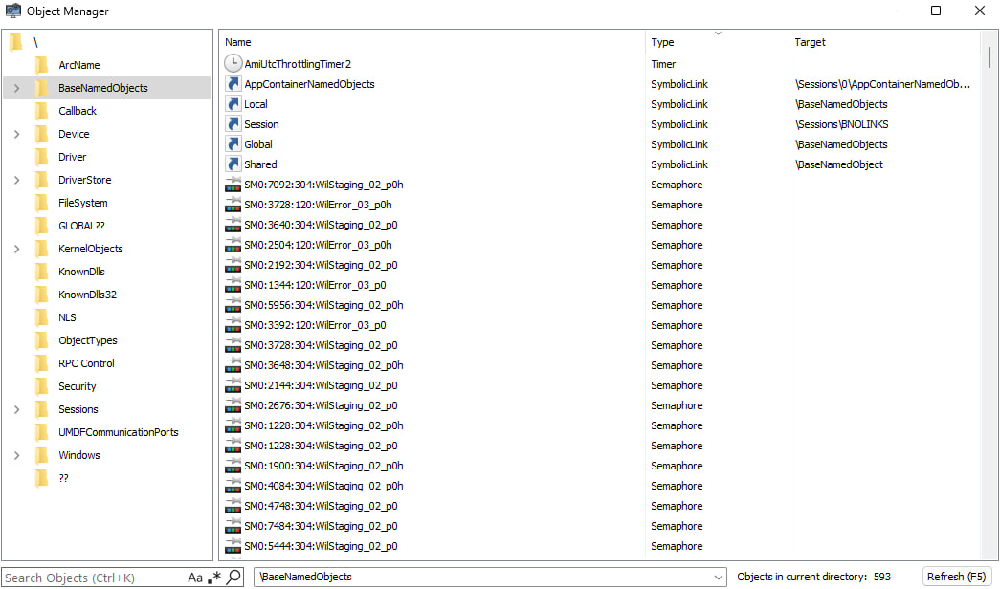
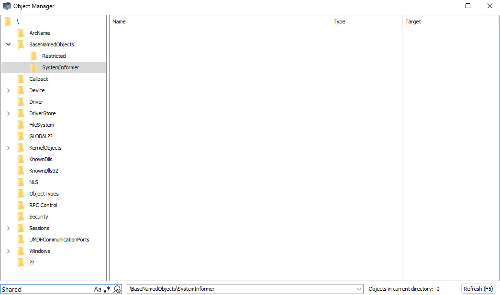

# krnl-shm-comm

## Description:
The project is designed to demonstrate the concept of an attack on the Windows Object Manager subsystem using DKOM. By completely hiding or spoofing objects, it's possible to bypass static and dynamic object analysis.

If we consider the project as a concept of hidden communication, it has critical flaws. One of the most significant problems is creating a system thread. Although the project demonstrates methods of hiding a system thread, when analyzing the scheduler we will see our thread evetually. It completely destroys our concept of "hidden communication", and is ABSOLUTELY not suitable for working in processes protected by a driver-based solution.

## Disclaimer:
> All actions were carried out solely for the purpose of studying defensive systems and testing the functionality and effectiveness of the methods described. I strongly condemn any interference with someone else's process!

# Proof of Concept:
In this example, we will examine the process of replacing a section object (our shared memory) with a symbolic link, and all further operations will take place in this context. If you're interested in replacing it with some other object, you need to study its fields and its actual state (so that your object doesn't raise too much suspicion). First,  let’s break down the OBJECT_HEADER structure and how it’s organized.

```cpp
0: kd> dt nt!_OBJECT_HEADER
   +0x000 PointerCount     : Int8B
   +0x008 HandleCount      : Int8B
   +0x008 NextToFree       : Ptr64 Void
   +0x010 Lock             : _EX_PUSH_LOCK
   +0x018 TypeIndex        : UChar
   +0x019 TraceFlags       : UChar
   +0x019 DbgRefTrace      : Pos 0, 1 Bit
   +0x019 DbgTracePermanent : Pos 1, 1 Bit
   +0x01a InfoMask         : UChar
   +0x01b Flags            : UChar
   +0x01b NewObject        : Pos 0, 1 Bit
   +0x01b KernelObject     : Pos 1, 1 Bit
   +0x01b KernelOnlyAccess : Pos 2, 1 Bit
   +0x01b ExclusiveObject  : Pos 3, 1 Bit
   +0x01b PermanentObject  : Pos 4, 1 Bit
   +0x01b DefaultSecurityQuota : Pos 5, 1 Bit
   +0x01b SingleHandleEntry : Pos 6, 1 Bit
   +0x01b DeletedInline    : Pos 7, 1 Bit
   +0x01c Reserved         : Uint4B
   +0x020 ObjectCreateInfo : Ptr64 _OBJECT_CREATE_INFORMATION
   +0x020 QuotaBlockCharged : Ptr64 Void
   +0x028 SecurityDescriptor : Ptr64 Void
   +0x030 Body             : _QUAD
```

So, having the entire structure obtained via KD, we can highlight the fields important for our purposes:
- `PointerCount`: reference counter for the object.
- `HandleCount`: counter of open handles.
- `NextToFree`: next pointer before object removal.
- `PermanentObject`: allows the object to avoid removal when the object remove condition is met: PointerCount == 0 && HandleCount == 0.
- `TypeIndex`: object type index.
- `InfoMask`: a bitmask for calculating offsets to optional object structures.
- `Body`: The beginning of a structure unique to each object type (SECTION in our case)

First of all, let's take a look at how the `InfoMask` field works. In the Windows kernel, there's a symbol `ObpInfoMaskToOffset` (an array of offsets) containing hardcoded information about offsets within the OBJECT_HEADER structure. Using an index and the bitmask, we can find out whether the object contains an optional structure we're interested in, for example: InfoMask & 0x02 - OBJECT_HEADER_NAME_INFO. To get the offset, we need to use the same AND operation to get an index in the array and get the value from the array at this index —  this will be our offset to the structure `ObpInfoMaskToOffset[InfoMask & 0x03]` —  offset to OBJECT_HEADER_NAME_INFO, and then we subtract the obtained offset from objectHeader and get the beginning of the optional structure.


Table of optional structures: (incomplete)
| Structure | InfoMask Bit | Offset Calculation | Description |
|-----------|--------------|-------------------|-------------|
| `OBJECT_HEADER_CREATOR_INFO` | 0x01 | `ObpInfoMaskToOffset[0]` | Information about object creator |
| `OBJECT_HEADER_NAME_INFO` | 0x02 | `ObpInfoMaskToOffset[1]` | Name and directory |
| `OBJECT_HEADER_HANDLE_INFO` | 0x04 | `ObpInfoMaskToOffset[2]` | Handle database information |
| `OBJECT_HEADER_QUOTA_INFO` | 0x08 | `ObpInfoMaskToOffset[3]` | Quota charges |
| `OBJECT_HEADER_PROCESS_INFO` | 0x10 | `ObpInfoMaskToOffset[4]` | Exclusive process owner |

### User-mode handle:
In order not to raise suspicion, we need to have the correct number of open handles for the object located in the `HandleCount` field. A symbolic link usually always has 1 handle open. Knowing this information, we must definitely close the handle in user mode (client). The object itself won't disappear at this moment, since cleanup only occurs when our `HandleCount`, `PointerCount` and `PermanentObject` fields are equal to 0, which naturally won't happen — there’s an open handle in the kernel at this moment, which means our counters won't be equal to 0.


```cpp
bool ClientConnection::connect()
{
	section = OpenFileMapping(FILE_MAP_READ | FILE_MAP_WRITE,
		FALSE, SHARED_MEMORY_CLIENT_NAME);

	if (section == nullptr)
	{
		return false;
	}

	sharedData = static_cast<PSHARED_DATA>(MapViewOfFile(section, FILE_MAP_READ | FILE_MAP_WRITE, 0,
		0, 0));

	if (sharedData == nullptr)
	{
		CloseHandle(section);
		return false;
	}

	sharedData->clientStatus = STATUS_CONNECTED;

	CloseHandle(section);

	connected = true;
	return true;
}
```

## 1. Objects spoofing:

### 1.1 Spoofing OBJECT_HEADER fields
Now we need to spoof several fields in the OBJECT_HEADER structure so that our section object becomes a symbolic link. A key part of this process is encrypting the Index from the SymbolicLinkType structure (OBJECT_TYPE) to generate the correct `TypeIndex` value.

```cpp
0: kd> dt nt!_OBJECT_TYPE
   +0x000 TypeList         : _LIST_ENTRY
   +0x010 Name             : _UNICODE_STRING
   +0x020 DefaultObject    : Ptr64 Void
   +0x028 Index            : UChar
   +0x02c TotalNumberOfObjects : Uint4B
   +0x030 TotalNumberOfHandles : Uint4B
   +0x034 HighWaterNumberOfObjects : Uint4B
   +0x038 HighWaterNumberOfHandles : Uint4B
   +0x040 TypeInfo         : _OBJECT_TYPE_INITIALIZER
   +0x0b8 TypeLock         : _EX_PUSH_LOCK
   +0x0c0 Key              : Uint4B
   +0x0c8 CallbackList     : _LIST_ENTRY
```

It's quite simple and looks as follows: `ObHeaderCookie ^ ObjectType->Index ^ ((reinterpret_cast<ULONG64>(objectHeader) >> 8) & 0xFF)`. This encryption works for all object types.

```cpp
NTSTATUS CommSharedMemoryHider::spoofObject()
{
    auto const ctx = getMemory()->getContext();

    PVOID object{};

    auto const sectionObjectType = *symbols->get<_OBJECT_TYPE*, &NT_OFFSETS::gMmSectionObjectType>(getNtoskrnlBase());
    auto const symbolLinkType = *symbols->get<_OBJECT_TYPE*, &NT_OFFSETS::gObpSymbolicLinkObjectType>(getNtoskrnlBase());
    auto const headerCookie = *symbols->get<ULONG, &NT_OFFSETS::gObHeaderCookie>(getNtoskrnlBase());

    auto const status = ObReferenceObjectByHandle(
        ctx->sectionHandle,
        NULL,
        sectionObjectType,
        KernelMode,
		&object,
        nullptr
    );

    if (!MmIsAddressValid(object) || !NT_SUCCESS(status))
    {
        return STATUS_UNSUCCESSFUL;
    }

	objectHeader = OBJECT_TO_OBJECT_HEADER(object);

    ObDereferenceObject(object);

    if (!MmIsAddressValid(objectHeader))
    {
        return STATUS_UNSUCCESSFUL;
    }

    memcpy(&origObjectHeader, objectHeader, sizeof(_OBJECT_HEADER));

    objectHeader->PermanentObject = 1;
    objectHeader->TypeIndex = headerCookie ^ symbolLinkType->Index ^ ((reinterpret_cast<ULONG64>(objectHeader) >> 8) & 0xFF);
    objectHeader->HandleCount = 0;
    objectHeader->NextToFree = nullptr;

    //++symbolLinkType.TotalNumberOfObjects
    //++symbolLinkType.TotalNumberOfHandles

    auto const symbolicLink = OBJECT_HEADER_TO_OBJECT(objectHeader, _OBJECT_SYMBOLIC_LINK)

    RtlInitUnicodeString(&symbolicLink->LinkTarget, L"\\BaseNamedObject");

    return STATUS_SUCCESS;
}
```

### 1.2 Removing the handle from the kernel space handle array
To avoid detection of an open handle from the system process (PID=4), we simply need to remove the pointer from the kernel handle array `ObpKernelHandleTable`. Also, a pointer to this table can be obtained from `EPROCESS::ObjectTable`. One more point worth highlighting — something I spent quite some time figuring out — is how kernel handles work. For a long time, I didn't understand why I couldn't get `handleTableEntry` using my handle, and while examining how `ObpKernelHandleTable` works, I noticed that `expLookupHandleTableEntry` only works with kernel handles...

```cpp
NTSTATUS CommSharedMemoryHider::removeHandleFromObject()
{
    auto const ctx = getMemory()->getContext();
    auto const handle = reinterpret_cast<ULONG64>(ctx->sectionHandle) ^ 0xFFFFFFFF80000000uLL;
    auto const krnlHandleTable = *symbols->get<_HANDLE_TABLE*, &NT_OFFSETS::gObpKernelHandleTable>(getNtoskrnlBase());
    auto const sectionObjectType = *symbols->get<_OBJECT_TYPE*, &NT_OFFSETS::gMmSectionObjectType>(getNtoskrnlBase());

    if (!MmIsAddressValid(krnlHandleTable))
    {
        return STATUS_UNSUCCESSFUL;
    }

    origHandleTableEntry = reinterpret_cast<PULONG64>(
        expLookupHandleTableEntry(
            reinterpret_cast<unsigned int*>(krnlHandleTable),
            handle
        )
        );

    if (!MmIsAddressValid(origHandleTableEntry))
    {
        return STATUS_UNSUCCESSFUL;
    }

    origHandleEntry = *origHandleTableEntry;
    *origHandleTableEntry = NULL;

    --sectionObjectType->TotalNumberOfHandles;

    return STATUS_SUCCESS;
}
```

### 1.3 Results:

<p align="center">
  
</p>

## 2. Unlinking objects:
To fully mask our presence, we need to become familiar with several structures. Along the way, let's highlight the relevant fields:

```cpp
0: kd> dt nt!_OBJECT_DIRECTORY
   +0x000 HashBuckets      : [37] Ptr64 _OBJECT_DIRECTORY_ENTRY
   +0x128 Lock             : _EX_PUSH_LOCK
   +0x130 DeviceMap        : Ptr64 _DEVICE_MAP
   +0x138 ShadowDirectory  : Ptr64 _OBJECT_DIRECTORY
   +0x140 NamespaceEntry   : Ptr64 Void
   +0x148 SessionObject    : Ptr64 Void
   +0x150 Flags            : Uint4B
   +0x154 SessionId        : Uint4B
```

- `HashBucket`: contains 37 OBJECT_DIRECTORY_ENTRY pointers.

```cpp
0: kd> dt nt!_OBJECT_DIRECTORY_ENTRY
   +0x000 ChainLink        : Ptr64 _OBJECT_DIRECTORY_ENTRY
   +0x008 Object           : Ptr64 Void
   +0x010 HashValue        : Uint4B
```

- `ChainLink`: singly linked list storing the next _OBJECT_DIRECTORY_ENTRY entry.
- `Object`: field relating to the _OBJECT_HEADER of the current entry.
- `HashValue`: something like hash("name") of the current entry

**Bucket structure**:
| Bucket Index | Chain Structure | Description |
|--------------|-----------------|-------------|
| `HashBuckets[0]` | Entry1 → Entry2 → Entry3 → nullptr | Chain of objects with same hash |
| `HashBuckets[1]` | Entry4 → Entry5 → nullptr | Fewer objects in chain |
| `HashBuckets[2]` | nullptr | Empty bucket (no objects with this hash) |
| `HashBuckets[3]` | Entry6 → nullptr | Single object in bucket |
| ... | ... | ... |
| `HashBuckets[36]` | EntryN → nullptr | Last bucket |

### 2.1 Directory search:
Now that we understand how the Object Manager stores its objects, we can implement a search for the desired directory. Note that to do this, we'll need the root directory, which can be obtained from `ObpRootDirectoryObject`.

```cpp
_OBJECT_DIRECTORY* CommSharedMemoryHider::findDirectory(const WCHAR* dirName)
{
    auto const rootDir = *symbols->get<_OBJECT_DIRECTORY*, &NT_OFFSETS::gObpRootDirectoryObject>(getNtoskrnlBase());
    auto const infoMaskToOffset = symbols->get<UCHAR, &NT_OFFSETS::gObpInfoMaskToOffset>(getNtoskrnlBase());

    for (auto const entry : rootDir->HashBuckets)
    {
        auto chainLink = entry;

        while (MmIsAddressValid(chainLink))
        {
            auto header = OBJECT_TO_OBJECT_HEADER(chainLink->Object)

            if (!MmIsAddressValid(header) || (header->InfoMask & 0x02) == 0)
            {
                chainLink = chainLink->ChainLink;
                continue;
            }

            auto const nameInfoOffset = infoMaskToOffset[header->InfoMask & 0x03];

            auto const nameInfo = reinterpret_cast<_OBJECT_HEADER_NAME_INFO*>(
                reinterpret_cast<char*>(header) - nameInfoOffset);

            if (nameInfo->Name.Length == 0 || !MmIsAddressValid(nameInfo->Name.Buffer))
            {
                chainLink = chainLink->ChainLink;
                continue;
            }

            if (wcscmp(nameInfo->Name.Buffer, dirName) == 0)
            {
                return reinterpret_cast<_OBJECT_DIRECTORY*>(header);
            }

            chainLink = chainLink->ChainLink;
        }
    }

    return nullptr;
}
```

### 2.2 Unlinking the object from Object Manager:
After obtaining the desired directory object (in my case it's `"\BaseNamedObjects"`), we need to repeat the same iteration to find our shared memory object for unlinking. 
When the object is found and if it’s the first entry in the list, we simply replace the directory entry with the next item in the chain (chainLink->ChainLink). Otherwise, we relink the previous entry to skip over the removed one (prevLink->ChainLink = chainLink->ChainLink).

```cpp
NTSTATUS CommSharedMemoryHider::removeObjectFromDirectory()
{
    auto const ctx = getMemory()->getContext();
    auto const sectionObjectType = *symbols->get<_OBJECT_TYPE*, &NT_OFFSETS::gMmSectionObjectType>(getNtoskrnlBase());

    PVOID object{};

    auto const status = ObReferenceObjectByHandle(
        ctx->sectionHandle,
        NULL,
        sectionObjectType,
        KernelMode,
        &object,
        nullptr
    );

    if (!NT_SUCCESS(status))
    {
        return status;
    }

    baseNamedObjectDir = findDirectory(L"BaseNamedObjects");

    if (!MmIsAddressValid(baseNamedObjectDir))
    {
        ObDereferenceObject(object);
        return STATUS_UNSUCCESSFUL;
    }

    for (auto& entry : baseNamedObjectDir->HashBuckets)
    {
        _OBJECT_DIRECTORY_ENTRY* prevLink{ nullptr };
        auto chainLink = entry;

        while (MmIsAddressValid(chainLink))
        {
            if (chainLink->Object == object)
            {
                origObjectEntry = chainLink;

                if (prevLink == nullptr)
                {
                    entry = chainLink->ChainLink;
                }
                else
                {
                    prevLink->ChainLink = chainLink->ChainLink;
                }

                --sectionObjectType->TotalNumberOfObjects;

                ObDereferenceObject(object);
                return STATUS_SUCCESS;
            }

            prevLink = chainLink;
            chainLink = chainLink->ChainLink;
        }

        bucketIdx++;
    }

    ObDereferenceObject(object);
    return STATUS_NOT_FOUND;
}
```

### 2.3 Repeating handle removing from [Objects spoofing](#12-removing-the-handle-from-the-kernel-space-handle-array)

### 2.4 Results:
<p align="center">
  
</p>

### 3 Restoring Manipulations
While browsing various forums in search of information about thread and memory hiding techniques, I often came across claims that unloading a driver after such manipulations is impossible. And i disagree with that. This project implements full restoration of hidden objects, threads and memory, allowing the driver’s execution to be safely stopped without triggering a BSOD (Blue Screen of Death).

# Additional Resources
[Geoff Chappell, Software Analyst (OBJECT_HEADER)](https://www.geoffchappell.com/studies/windows/km/ntoskrnl/inc/ntos/ob/object_header/index.htm)

[A Light on Windows 10's “OBJECT_HEADER->TypeIndex”](https://medium.com/@ashabdalhalim/a-light-on-windows-10s-object-header-typeindex-value-e8f907e7073a)

# Credits:
[@KDmapper](https://github.com/TheCruZ/kdmapper)

